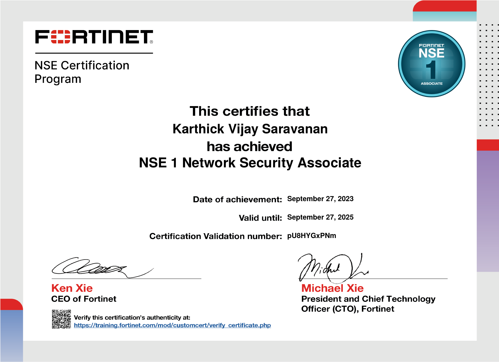
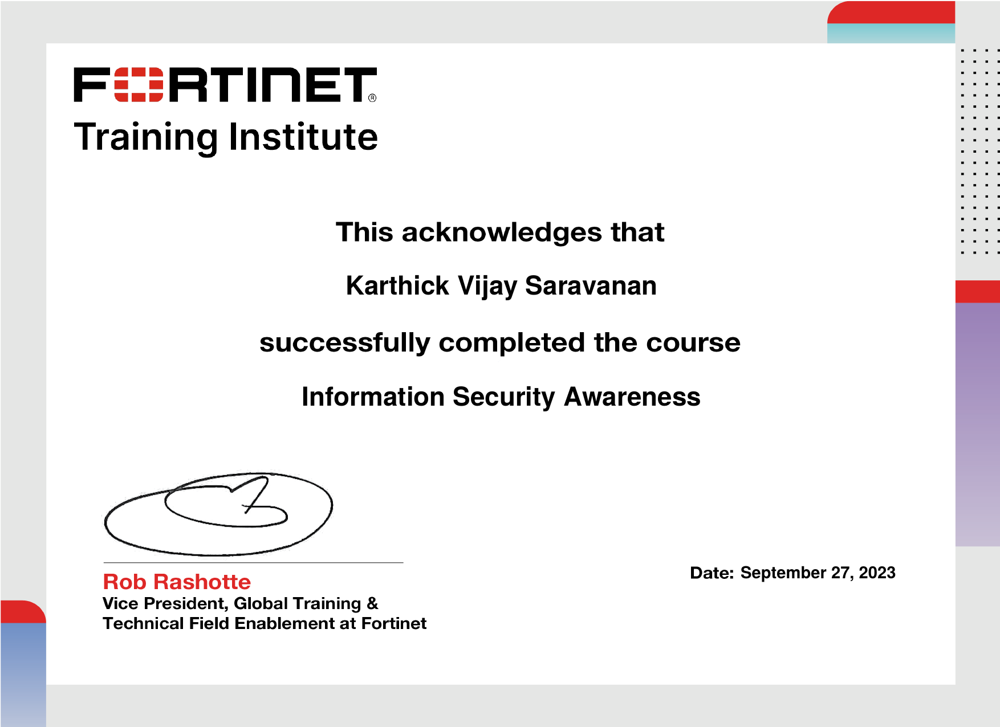
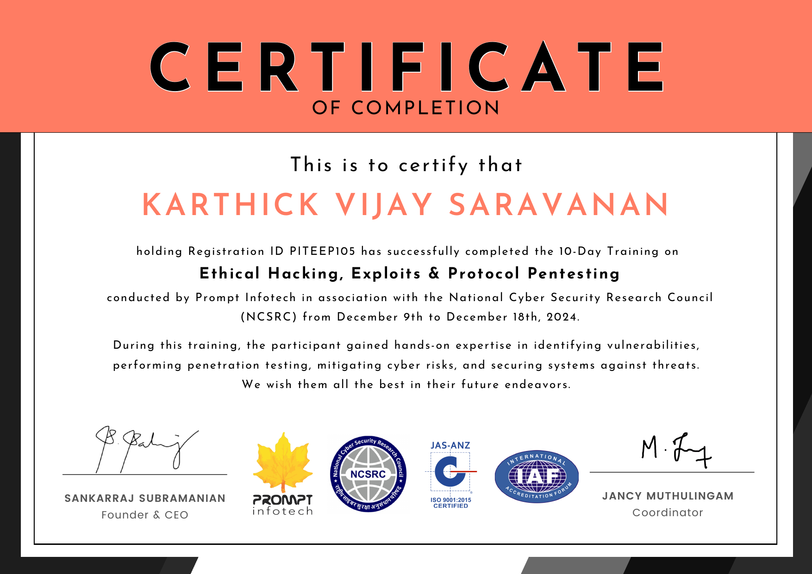
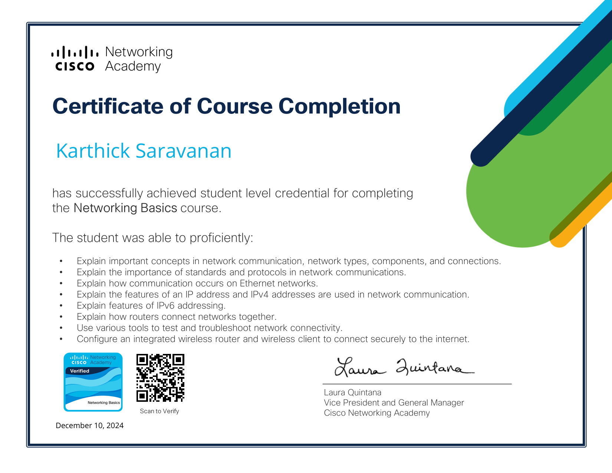
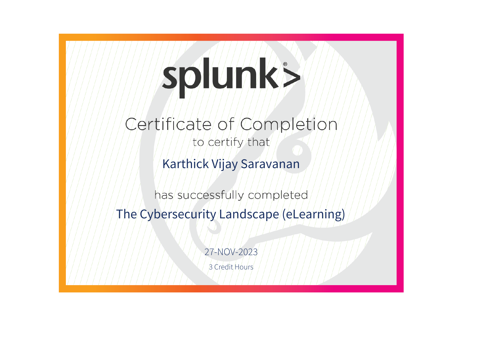
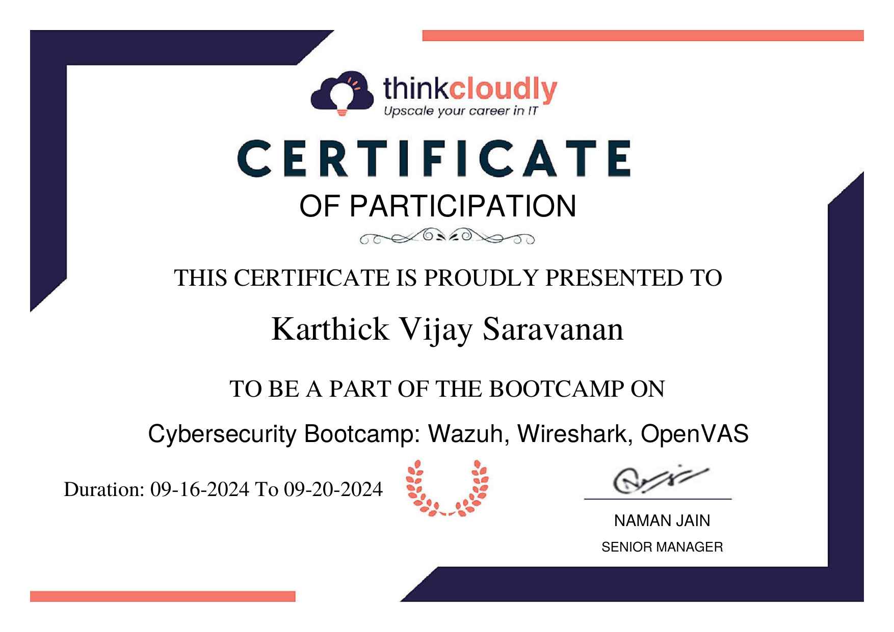
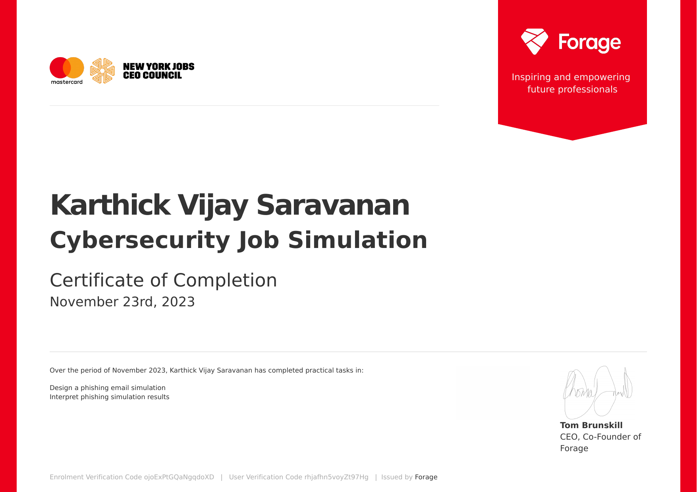
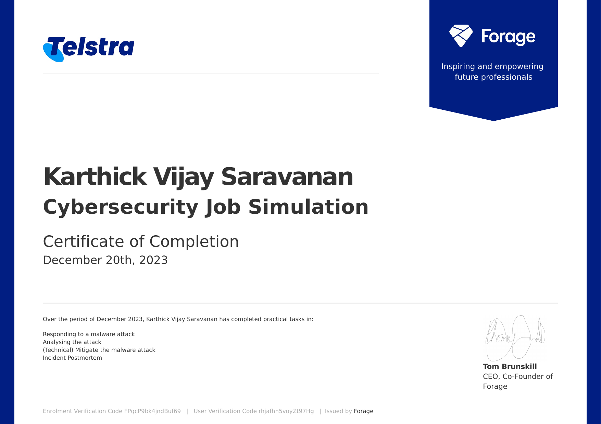

# Karthick Vijay Saravanan

<div align="center">


</div>

<div align="center">

[](https://linkedin.com/in/karthickvijay)
[](mailto:skarthickvijay@outlook.com)
[](https://tryhackme.com/p/KarthVj)
[](https://github.com/KarthVj)

</div>

---

## 👋 Hey, I'm Karthick

I didn't get into cybersecurity through a textbook. I got into it because I spent two years being the person in the room when something went wrong — figuring out what happened, who did it, and how to stop it from happening again.

That started in retail security operations at Sephora and Walmart, where I learned how to investigate incidents methodically, document findings clearly, and communicate urgency without creating panic. Those are the same skills that make a good SOC analyst — the environment looks different, but the discipline is identical.

Now I'm channelling that experience into blue team cybersecurity — building tools that automate the repetitive parts of triage, studying the frameworks that map how attackers think, and getting hands-on with the platforms that real security teams run on. I practice on **TryHackMe** regularly and I'm actively preparing for the **SAL1 (Security Analyst Level 1)** exam alongside **CompTIA Security+**.

I hold a **Postgraduate Certificate in Information Security Management** from Fanshawe College, London ON, and I'm based in **London, Ontario** — open to SOC analyst, security analyst, and IT security roles across Canada, remote or hybrid.

When I'm not doing any of that, I'm probably overthinking a PUBG strategy or deep in a TryHackMe room at 1am.

---

## 🚀 Projects

### 🤖 [AI-Powered Phishing Email Analyzer](https://github.com/KarthVj/ai-phishing-analyzer)
Automates phishing email triage for SOC analysts. Extracts IOCs, scores risk from 0–100 across five indicator categories, and uses Claude AI to classify the attack, map it to MITRE ATT&CK, and generate SOC action recommendations. Works fully offline — no API key needed for heuristic analysis.

`Python` `Anthropic Claude API` `IOC Extraction` `MITRE ATT&CK` `Heuristic Scoring`

---

### 🛡️ [SOC Alert Triage AI](https://github.com/KarthVj/soc-triage-ai)
AI-powered Tier 1 SOC triage assistant. Takes raw SIEM alert data, scores it instantly across six risk factors, then runs Claude AI for contextual threat analysis with MITRE ATT&CK mapping and clear escalation decisions. Built to replicate the L1 analyst workflow end-to-end.

`Python` `SIEM Integration` `Incident Response` `Claude AI` `L1/L2/L3 Escalation`

---

### 📋 [Incident Operations Lab](https://github.com/KarthVj/Incident-Ops-Lab)
A production incident operations lab covering the full lifecycle: P1 response playbooks, L1/L2/L3 escalation matrix with decision tree, mobile crash spike response (iOS/Android/React Native), observability tool notes (Datadog, CloudWatch, Splunk), real sample log files for triage practice, and a fully completed post-incident review example.

`Operations` `Playbooks` `Observability` `Post-Incident Review` `Escalation`

---

## 🧰 Tools & Technologies

```
Security Platforms    │  Microsoft Sentinel · Splunk · IBM QRadar SOAR · CrowdStrike Falcon
                      │  Microsoft 365 Defender · Proofpoint TRAP · Abnormal Security · Wazuh
──────────────────────┼──────────────────────────────────────────────────────────────────────
Testing & Recon       │  Metasploit · Burp Suite · Nmap · Wireshark · OpenVAS · VirtualBox
──────────────────────┼──────────────────────────────────────────────────────────────────────
Languages             │  Python · Bash · PowerShell · SQL · JavaScript (basics)
──────────────────────┼──────────────────────────────────────────────────────────────────────
Cloud & Infra         │  AWS (EC2, S3, CloudWatch) · Microsoft Azure · Active Directory
                      │  Windows Server · VMware · Cisco Networking · DHCP/DNS
──────────────────────┼──────────────────────────────────────────────────────────────────────
Frameworks            │  MITRE ATT&CK · NIST CSF 2.0 · ISO 27001 · OWASP · ITIL · COBIT
──────────────────────┼──────────────────────────────────────────────────────────────────────
Learning Platforms    │  TryHackMe (active) · SAL1 Prep · CompTIA Security+ (in progress)
```

---

## 📜 Certifications & Training

> All certificate documents are stored in this repository folder.

---

### ✅ Microsoft — Student SOC Program Foundations
**Microsoft · Completed September 5, 2025**


*SOC Operations · Security Monitoring · Alert Triage · Incident Response · Microsoft Security Stack*

---

### ✅ Fortinet NSE 1 — Network Security Associate
**Fortinet · September 27, 2023 · Valid until September 27, 2025 · Verification: pU8HYGxPNm**



*Firewall Concepts · Threat Prevention · Network Security Controls · FortiGate Fundamentals*

---

### ✅ Fortinet — Information Security Awareness
**Fortinet Training Institute · September 27, 2023**



*Security Awareness · Threat Landscape · Social Engineering · Information Protection Practices*

---

### ✅ Ethical Hacking, Exploits & Protocol Pentesting
**Prompt Infotech / NCSRC · December 9–18, 2024 · Reg ID: PITEEP105**



*Vulnerability Assessment · Penetration Testing · Exploit Analysis · Protocol Security · Hands-on Lab Work*

---

### ✅ Cisco Networking Academy — Networking Basics
**Cisco Networking Academy · December 10, 2024**



*Network Communication · TCP/IP · IPv4 & IPv6 · Routing & Switching · Wireless Configuration · Troubleshooting*

---

### ✅ Splunk — The Cybersecurity Landscape (eLearning)
**Splunk · November 27, 2023 · 3 Credit Hours**



*Cybersecurity Fundamentals · Threat Landscape · Security Operations · Splunk Platform Overview*

---

### ✅ Cybersecurity Bootcamp — Wazuh, Wireshark, OpenVAS
**ThinkCloudly · September 16–20, 2024**



*Wazuh SIEM · Wireshark Packet Analysis · OpenVAS Vulnerability Scanning · Hands-on Security Lab*

---

### ✅ Mastercard — Cybersecurity Job Simulation (Forage)
**Mastercard / Forage · November 23, 2023**



*Phishing Email Simulation Design · Phishing Campaign Analysis · Security Awareness Programs*

---

### ✅ Telstra — Cybersecurity Job Simulation (Forage)
**Telstra / Forage · December 20, 2023**



*Malware Attack Response · Attack Analysis · Technical Mitigation · Incident Postmortem*

---

### 🔄 CompTIA Security+ — In Progress
**CompTIA · Expected 2026**

*Network Security · Risk Management · Threat Mitigation · Governance · Compliance*

---

### 🔄 SAL1 — Security Analyst Level 1 (Preparing)
**CompTIA · In Preparation**

*SOC Operations · Threat Monitoring · Incident Detection · Log Analysis · Security Tools*

---

## 🎓 Education

| | Qualification | Institution | Year |
|---|---|---|---|
| 🏫 | Postgraduate Certificate — Information Security Management | Fanshawe College, London ON | 2023 |
| 🏫 | Postgraduate Certificate — Aerospace Operations Management | Fanshawe College, London ON | 2024 |
| 🎓 | Bachelor of Technology — Information Technology | Anna University, India | 2022 |

*Key coursework: ISO 27001 · HIPAA · NIST CSF 2.0 · ITIL · COBIT · CVSSv4 · OWASP · MITRE ATT&CK · Cloud Security · Data Privacy & Compliance*

---

## 🤝 Let's Connect

I'm actively looking for SOC analyst, security analyst, and junior cybersecurity roles across Canada — London, Toronto, remote or hybrid. If you're hiring or just want to talk shop about blue team operations, incident response, or threat detection, I'm always up for it.

<div align="center">

[](https://linkedin.com/in/karthickvijay)
[](mailto:skarthickvijay@outlook.com)
[](https://tryhackme.com/p/KarthVj)
[](https://github.com/KarthVj)

</div>

---

<div align="center">

*Building in public · Learning out loud · London, Ontario 🇨🇦*

*"The strength of a security system is measured not by how it handles normal situations, but by how it handles attacks."*

</div>
